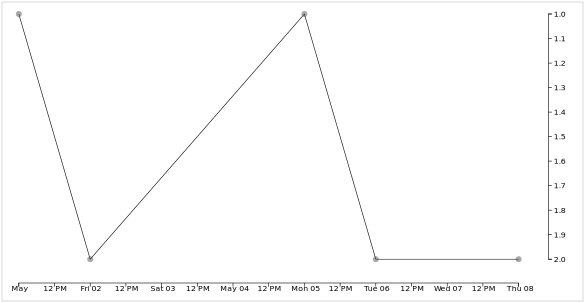
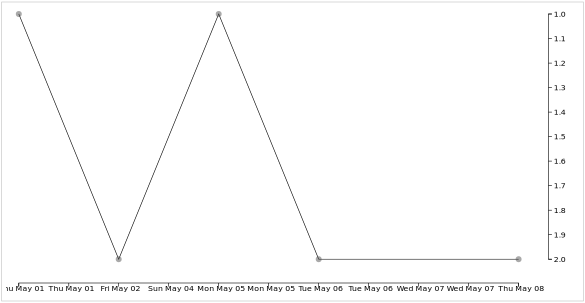

For a typical time-series data, one would use the `d3.time.scale` scale. This scale, however, does not work for plotting non-uniform time-series data (for eg. market data) where weekend days show as gaps and are undesirable.

The easy way around this is to map weekdays onto a uniform scale and use the linear scale to plot it. There is a great example for this by Mike Bostock in [weekday.js](https://gist.github.com/mbostock/5827353) gist. Simple tick formatting can be added to show proper dates instead of the weekday numbers:
    
    var dateFormat = d3.time.format('%a %b %d');
    xAxis.tickFormat(function (d) { return dateFormat(weekday.invert(d));});
    

So far so good, but now the dynamic tick format that comes with `d3.time.scale` scale is lost. The easiest way to get this functionality back is to yank the code from `d3.time.scale` and do some slight adjustments to make it work with our interpretations of days (`d3_time_scaleLocalFormat`, `scale.ticks`, and associated functions). These can then be used as follows:
    
    xAxis
      .tickFormat(my_time_scaleLocalFormat)
      .tickValues(my_scale_ticks);

Unfortunately, some these functions can't be reused, as they are declared as private, and others need slight modifications to cope with weekdays instead of Date objects. For simple one-off use, the above solution is probably good enough, but if you need ease of reuse or have more complex application, it might be easier to wrap this up as a standalone scale.

The scale takes a mapping function as a parameter, and produces a scale with dynamic date-based tics like the `d3.time.scale` scale does.

One addition to Mike's weekday example was caching. For small data sets it works well, but With a couple of axes, brush, and a few years worth of weekday data, the conversion was getting noticeable.

The final code, including an example, modified weekday.js and the `d3.scale.dayselect` scale can be found in the [Dayselect Scale](http://bl.ocks.org/mayo/e27554b34bff1f177c05) block (or [Gist](https://gist.github.com/mayo/e27554b34bff1f177c05)).

One caveat with this method is when using brush, the extent of the brush is returned as date objects, but they are really integers representing weekdays on the uniform scale. This can be easily fixed by prepending a plus sign (`+`) before it, or doing a math operation on the values: `+brush.extent()[0]` or `brush.extent()[0] * 1`.

